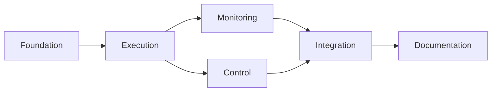

# Phase 1: Epic Breakdown

## Overview
Phase 1 delivers the MVP - a single task delegation system that proves the core value proposition in 2 weeks.

## Out of Scope for Phase 1
The following features are explicitly deferred to later phases:
- **CLI interface** (Phase 2) - MCP tools only for MVP
- **Multiple concurrent tasks** (Phase 2) - Single task execution only
- **Task persistence** (Phase 4) - In-memory state only
- **Priority queues** (Phase 3) - Simple execution for MVP
- **Git worktree isolation** (Phase 3) - Direct execution only

---

## Epic 1: Foundation (Days 1-2)
**Goal**: Establish project structure and core MCP server

### User Stories
1. **As a developer**, I want a TypeScript project setup, so I can start development
2. **As a developer**, I want an MCP server scaffold, so Claude can connect to it
3. **As a developer**, I want type definitions, so I have type safety

### Tasks
```
FOUND-001: Initialize TypeScript project
├── Create package.json with dependencies
├── Configure tsconfig.json
├── Setup project structure (src/, dist/, etc.)
├── Create .gitignore
└── Verify build process works

FOUND-002: Setup MCP server scaffold
├── Install @modelcontextprotocol/sdk
├── Create src/index.ts entry point
├── Implement basic MCP server class
├── Setup StdioServerTransport
└── Test server starts without errors

FOUND-003: Define TypeScript types
├── Create src/types.ts
├── Define Task interface
├── Define tool input/output types
├── Define error types
└── Export all types
```

### Acceptance Criteria
- [ ] `npm run dev` starts the server
- [ ] Server logs "MCP server started"
- [ ] No TypeScript errors
- [ ] Can connect from MCP Inspector

### Effort: 2 days

---

## Epic 2: Task Execution (Days 3-4)
**Goal**: Implement core task delegation functionality

### User Stories
1. **As a user**, I want to delegate a task, so it runs in the background
2. **As a developer**, I want process management, so tasks execute properly

### Tasks
```
EXEC-001: Implement DelegateTask tool
├── Create src/tools/delegate.ts
├── Define tool schema
├── Implement request handler
├── Generate unique task IDs
└── Return task ID to user

EXEC-002: Create process executor
├── Create src/executor.ts
├── Implement spawn wrapper
├── Handle Claude Code CLI arguments
├── Setup process event handlers
└── Store process reference

EXEC-003: Implement output capture
├── Setup stdout stream handler
├── Setup stderr stream handler
├── Buffer output in memory
├── Handle stream encoding
└── Store output with task
```

### Acceptance Criteria
- [ ] Can call DelegateTask from Claude
- [ ] Returns task ID immediately
- [ ] Claude Code process spawns
- [ ] Output is captured
- [ ] Process completes successfully

### Effort: 2 days

---

## Epic 3: Task Monitoring (Day 5)
**Goal**: Enable users to monitor and retrieve task results

### User Stories
1. **As a user**, I want to check task status, so I know when it's done
2. **As a user**, I want to see task output, so I can use the results

### Tasks
```
MON-001: Implement TaskStatus tool
├── Create src/tools/status.ts
├── Define tool schema
├── Lookup task by ID
├── Return status (running/completed/failed)
└── Include basic metadata

MON-002: Implement TaskLogs tool
├── Create src/tools/logs.ts
├── Define tool schema (with tail option)
├── Retrieve output buffer
├── Format output for display
└── Handle missing task ID

MON-003: Add task state management
├── Create task registry Map
├── Track task lifecycle
├── Update status on events
├── Clean completed tasks (after 1 hour)
└── Handle edge cases
```

### Acceptance Criteria
- [ ] TaskStatus returns correct status
- [ ] TaskLogs returns captured output
- [ ] Can tail last N lines
- [ ] Handles invalid task IDs gracefully
- [ ] Memory doesn't leak from old tasks

### Effort: 1 day

---

## Epic 4: Task Control (Days 6-7)
**Goal**: Allow users to manage running tasks

### User Stories
1. **As a user**, I want to cancel a task, so I can stop unwanted execution
2. **As a developer**, I want graceful shutdown, so tasks clean up properly

### Tasks
```
CTRL-001: Implement CancelTask tool
├── Create src/tools/cancel.ts
├── Define tool schema
├── Find running process
├── Send SIGTERM signal
└── Update task status

CTRL-002: Handle process lifecycle
├── Implement graceful termination
├── Add SIGKILL fallback (after 5s)
├── Clean up resources
├── Update task state
└── Log cancellation

CTRL-003: Error handling
├── Handle spawn failures
├── Handle process crashes
├── Capture error messages
├── Set failed status
└── Make errors visible in logs
```

### Acceptance Criteria
- [ ] Can cancel running task
- [ ] Process terminates cleanly
- [ ] Status updates to "cancelled"
- [ ] Errors are captured and logged
- [ ] No zombie processes

### Effort: 2 days

---

## Epic 5: Integration (Days 8-9)
**Goal**: Integrate with Claude Desktop and ensure quality

### User Stories
1. **As a user**, I want to use Claudine from Claude Desktop
2. **As a developer**, I want confidence the system works

### Tasks
```
INT-001: Claude Desktop integration
├── Create config example
├── Document installation steps
├── Test all tools from Claude
├── Fix integration issues
└── Create demo video

INT-002: Testing suite
├── Setup Vitest
├── Unit test tools
├── Test process executor
├── Test error cases
└── Mock child_process

INT-003: Error scenarios
├── Test task not found
├── Test already running
├── Test process crash
├── Test timeout (30min)
└── Test memory limits
```

### Acceptance Criteria
- [ ] Works in Claude Desktop
- [ ] All tools callable
- [ ] Tests pass (>80% coverage)
- [ ] Handles errors gracefully
- [ ] No crashes under normal use

### Effort: 2 days

---

## Epic 6: Documentation & Ship (Day 10)
**Goal**: Make it usable by others

### User Stories
1. **As a user**, I want clear setup instructions
2. **As a user**, I want to understand how to use it

### Tasks
```
DOC-001: User documentation
├── Write README.md
├── Installation guide
├── Configuration steps
├── Usage examples
└── Troubleshooting

DOC-002: Examples
├── Create examples/ directory
├── Parallel test updates
├── Background builds
├── Documentation generation
└── Git operations

DOC-003: Release preparation
├── Version number (0.1.0)
├── Create GitHub release
├── Test fresh installation
├── Announce to early users
└── Setup feedback channel
```

### Acceptance Criteria
- [ ] README is complete
- [ ] Examples work
- [ ] Fresh install succeeds
- [ ] Users can self-serve setup
- [ ] Feedback mechanism exists

### Effort: 1 day

---

## Sprint Planning

### Sprint 1.1 (Days 1-5)
- Epic 1: Foundation
- Epic 2: Task Execution  
- Epic 3: Task Monitoring

**Goal**: Core functionality working

### Sprint 1.2 (Days 6-10)
- Epic 4: Task Control
- Epic 5: Integration
- Epic 6: Documentation

**Goal**: Polished and shippable

---

## Task Sizing

| Size | Description | Examples |
|------|------------|----------|
| XS | < 1 hour | Add type definition |
| S | 1-2 hours | Implement simple tool |
| M | 2-4 hours | Process executor |
| L | 4-8 hours | Integration testing |
| XL | 1+ days | Epic completion |

---

## Dependencies



---

## Risk Mitigation

| Epic | Risk | Mitigation |
|------|------|------------|
| 1 | Setup complexity | Use minimal config |
| 2 | Process spawning issues | Test early, have fallback |
| 3 | Memory leaks | Implement cleanup |
| 4 | Zombie processes | Force kill backup |
| 5 | Claude Desktop incompatibility | Test daily |
| 6 | Poor documentation | Get user feedback |

---

## Definition of Done (Phase 1)

### Epic Complete When:
- [ ] All tasks completed
- [ ] Acceptance criteria met
- [ ] Code reviewed (self)
- [ ] Tests written
- [ ] No critical bugs

### Phase Complete When:
- [ ] All epics completed
- [ ] Integration tested end-to-end
- [ ] Documentation complete
- [ ] Deployed to early users
- [ ] Feedback channel active